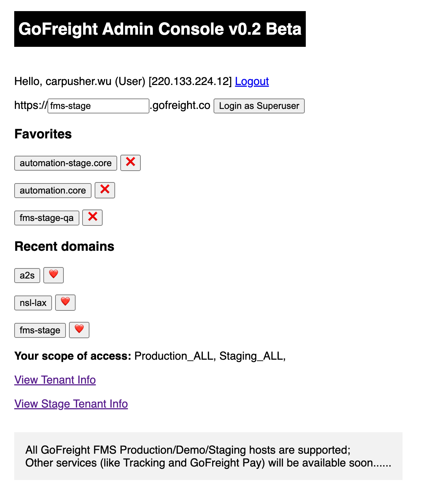

# userscripts

## Installation

1. Install a userscript manager like [Tampermonkey](https://www.tampermonkey.net/).
1. Click on the script below you want to install and then click `Install`.

## Scripts

- Github
  - [Github Easy Approve](https://github.com/carpusherw/userscripts/raw/refs/heads/main/src/github/easy-approve.user.js)
    - Add a button to approve a pull request with a single click.
- GoFreight
  - [Admin Console helper](https://github.com/carpusherw/userscripts/raw/refs/heads/main/src/gofreight/admin-console.user.js)
    - Remember 10 recently used domains.
    - Add recently used domains to favorites.
    - Add stage tenant info link below the original (prod) tenant info link.

    
